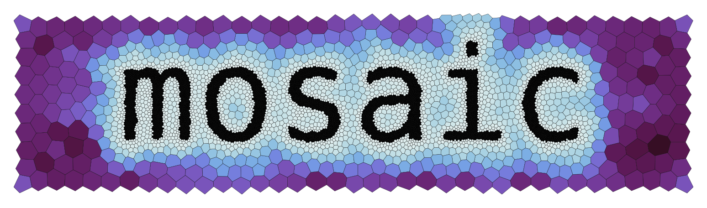

  

______________________________________________________________________

`mosaic` enables visualization of unstructured [MPAS](https://mpas-dev.github.io/)
mesh data on the native grid through `matplotlib`.

## Documentation

The latest `mosaic` documentation can be found here:

https://docs.e3sm.org/mosaic/

## Requests for help

If you have any trouble with `mosaic`, especially problems plotting your `MPAS`
mesh of choice, please reach out via [GitHub discussions](https://github.com/E3SM-Project/mosaic/discussions)
under the ["Q&A" category](https://github.com/E3SM-Project/mosaic/discussions/categories/q-a).
