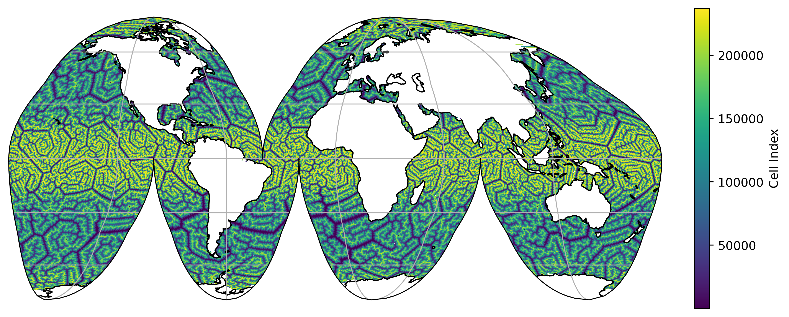
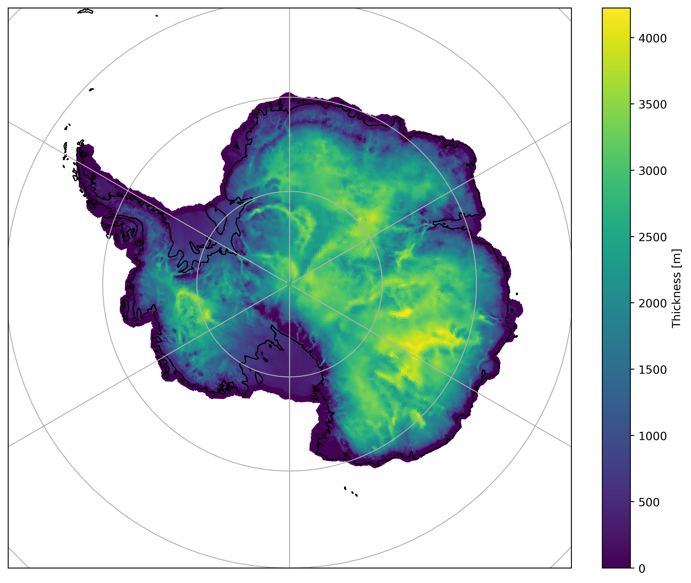

# Quick Start for Users

## Instaling `mosaic`

You can install the latest version of `mosaic` from conda-forge by running:
```
conda config --add channels conda-forge
conda config --set channel_priority strict

conda install -y mosaic
```

For a developers installation guide, see the [section](Dev_install_guide) developers quickstart.

## Example Usage 

### Global Mesh

First we need to download a valid MPAS mesh. To do so run:
```
curl https://web.lcrc.anl.gov/public/e3sm/inputdata/ocn/mpas-o/EC30to60E2r3/mpaso.EC30to60E2r3.230313.nc -o mpaso.EC30to60E2r3.230313.nc
```

Then we can use `mosaic` to plot on the native mesh using `matplotlib`. For example:
```python
import cartopy.crs as ccrs
import mosaic
import matplotlib.pyplot as plt
import xarray as xr

ds = xr.open_dataset("mpaso.EC30to60E2r3.230313.nc")

# define a map projection for our figure
projection = ccrs.InterruptedGoodeHomolosine()
# define the transform that describes our dataset
transform = ccrs.PlateCarree()

# create the figure and a GeoAxis 
fig, ax = plt.subplots(1, 1, figsize=(9,7), facecolor="w",
                       constrained_layout=True,
                       subplot_kw=dict(projection=projection))

# create a `Descriptor` object which takes the mesh information and creates 
# the polygon coordinate arrays needed for `matplotlib.collections.PolyCollection`.
descriptor = mosaic.Descriptor(ds, projection, transform)

# using the `Descriptor` object we just created, make a pseudocolor plot of
# the "indexToCellID" variable, which is defined at cell centers.
collection = mosaic.polypcolor(ax, descriptor, ds.indexToCellID, antialiaseds=False)

ax.gridlines()
ax.coastlines()
fig.colorbar(collection, fraction=0.1, shrink=0.5, label="Cell Index")

plt.show()
```



### Planar Non-Periodic 

First we need to download a valid MPAS mesh. To do so run:
```
curl https://web.lcrc.anl.gov/public/e3sm/inputdata/glc/mpasli/mpas.ais8to30km/ais_8to30km.20231222.nc -o mpasli.ais8to30km.nc
```

In this case the underlying coordinate arrays (i.e. `xCell/yCell`)
correspond to a South Polar Stereographic, which is also the map projection we
want to us. Therefore, the `projection` and the `transform` will be equivalent
for this example. When instantiating the `mosaic.Descriptor` object we have to 
careful to set `use_latlon=False`, which is the default, to ensure the
`xCell`/`yCell` coordinate arrays are parsed (c.f. `lonCell`/`latCell`). 

```python
import cartopy.crs as ccrs
import mosaic
import matplotlib.pyplot as plt
import xarray as xr

ds = xr.open_dataset("mpasli.ais8to30km.nc").squeeze()

# define a map projection for our figure
projection = ccrs.SouthPolarStereo()
# define the transform that describes our dataset
transform = ccrs.SouthPolarStereo()

# create the figure and a GeoAxis 
fig, ax = plt.subplots(1, 1, figsize=(9,7), facecolor="w",
                       constrained_layout=True,
                       subplot_kw=dict(projection=projection))

# create a `Descriptor` object which takes the mesh information and creates 
# the polygon coordinate arrays needed for `matplotlib.collections.PolyCollection`.
descriptor = mosaic.Descriptor(ds, projection, transform)

# using the `Descriptor` object we just created, make a pseudocolor plot of
# the "indexToCellID" variable, which is defined at cell centers.
collection = mosaic.polypcolor(ax, descriptor, ds.thickness, antialiaseds=False)

# Because this is not a global mesh, it's neccessary to explicitly set it's extent. 
ax.set_extent([-180, 180, -90, -60], ccrs.PlateCarree())

ax.gridlines()
ax.coastlines()
fig.colorbar(collection, fraction=0.1, label="Thickness [m]")
```


In the case where we do not know what projection the coordinate arrays of the
mesh correspond to we can use the `lonCell`/`latCell` coordinates and `mosaic`
will handle the transformation to the requested map projection under the hood.
In this scenario the `transform` should correspond to `ccrs.SouthPolarStereo()`
and `use_latlon=True` must be set in the `mosaic.Descriptor` object
instantiation. Nearly all the lines would be the same as the above example,
with the exception of the transform definition: 
```python 
# define the transform that describes our dataset
transform = ccrs.PlateCarree()
```
and the `mosaic.Descriptor` instantiation: 
```python
# ensure the `Descriptor` object use the lat/lon arrays
descriptor = mosaic.Descriptor(ds, projection, transform, use_latlon=True)
```
